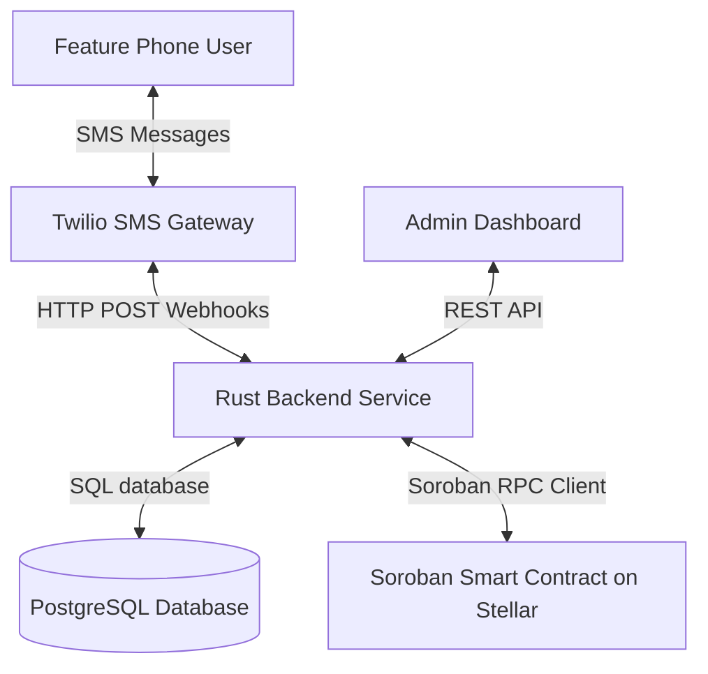

# PesaText Architecture Overview

PesaText is an SMS-based DeFi assistant enabling Kenyan feature phone users (who may not have smart devices or reliable internet access) to participate in micro-savings, asset transfers, and peer-to-peer liquidity loans.

## High-Level Workflow

### Components

1. **Feature Phone User Interface (SMS)**:
   - Users interact with the assistant via simple text messages containing keyword commands (e.g. `START`, `BALANCE`, `DEPOSIT`, `LOAN [amount]`, `REPAY [amount]`).
   
2. **Twilio SMS Gateway**:
   - Forwards incoming user texts to the backend webhook listener and delivers outgoing automated responses back to users' handsets.

3. **Rust Backend Service**:
   - Parses SMS content using a command routing parser.
   - Validates user identity and transaction requests.
   - Updates PostgreSQL transaction states and triggers on-chain smart contract calls on the Stellar network.

4. **Soroban Smart Contract**:
   - Deployed on Stellar Testnet.
   - Securely locks user deposits, tracks outstanding principal/interest balances, and processes loan payouts/repayments on-chain.

5. **Admin Dashboard (React + Vite + Tailwind)**:
   - Provides system administrators with visibility into user directories, transaction streams, active credit lines, and pending deposits.
   - Facilitates manual deposit verifications (acting as an M-Pesa clearing bridge) and registers alternative loan repayments.
